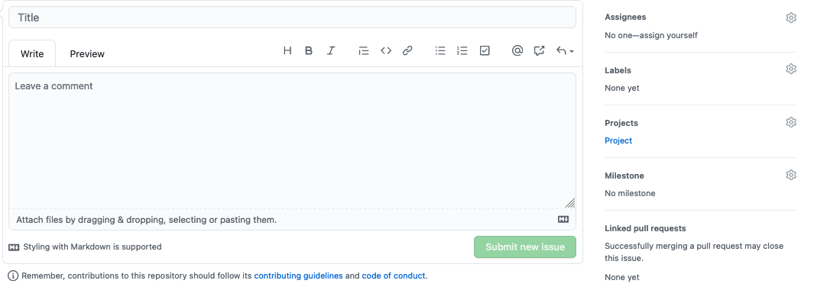

# NJITACM-OpenSource
Document that list how the NJITACM Open Source Program and how to contribute!

## Goal
* The goal of this repository is to enumerate the steps to contribute to NJITACM's Open-Source Program.

## Purpose
* We want to student's to have the chance to work an Organization  on Github

## Process

### Issue Method
1. Create an Issue with `Project` selected under Project 
    * Select 

* In title, type `Project Name`
* Leave a comment with `Description of the Project`

2. Done!

### Pull Request (PR) Method
1. Update the [projects.md](projects.md) file with your `Project` linked to location on Github that your Project Resides and with a `Short Project Description`

2. Done!

## Closing
* Thanks in advance, NJIT ACM TEAM